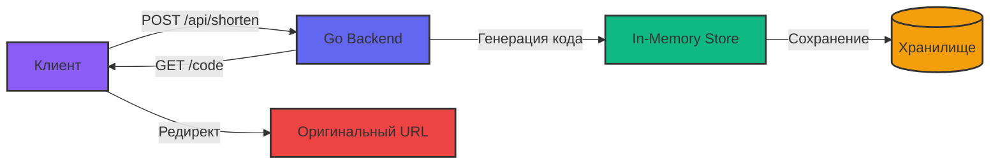

# ✨ Crisp URL Shortener

<div align="center">


[](https://golang.org)
[](LICENSE)
[](http://makeapullrequest.com)

**Элегантный, быстрый и надёжный сервис сокращения ссылок**

[Демо](#) • [Документация](#) • [Отчёт о проблемах](https://github.com/yourusername/crisp-url-shortener/issues)

</div>

---

## 📋 Оглавление

- [🌟 Особенности](#-особенности)
- [🏗 Архитектура](#-архитектура)
- [🚀 Быстрый старт](#-быстрый-старт)
- [📦 Установка](#-установка)
- [🔧 Конфигурация](#-конфигурация)
- [📖 API Документация](#-api-документация)
- [💻 Использование](#-использование)
- [📁 Структура проекта](#-структура-проекта)
- [🛠 Технологии](#-технологии)
- [🤝 Вклад в проект](#-вклад-в-проект)
- [📄 Лицензия](#-лицензия)

---

## 🌟 Особенности

<div align="center">

| Функция | Описание |
|---------|----------|
| 🚀 **Мгновенное сокращение** | Создание коротких ссылок за миллисекунды |
| 📊 **Встроенная статистика** | Отслеживание количества переходов по каждой ссылке |
| 🔒 **Безопасность** | Потокобезопасное хранилище с поддержкой конкурентных запросов |
| 🎨 **Современный UI** | Адаптивный дизайн с эффектом стекла и анимациями |
| 🌐 **RESTful API** | Чистый и интуитивно понятный API интерфейс |
| ⚡ **Высокая производительность** | Оптимизированный код на Go с минимальным потреблением ресурсов |

</div>

## 🏗 Архитектура



## 🚀 Быстрый старт

### Предварительные требования

- **Go** 1.21 или выше
- **Современный браузер** (Chrome, Firefox, Safari, Edge)
- **Любой HTTP сервер** для фронтенда (или просто открыть через Live Server)

### Установка за 1 минуту

```bash
# Клонируем репозиторий
git clone https://github.com/maypress/crisp.git
cd crisp-url-shortener

# Запускаем бэкенд
cd back
go run main.go

# В новом терминале запускаем фронтенд (выберите один из способов)
cd ../web
python3 -m http.server 3000
# или
npx serve .
# или используйте Live Server в VS Code
```

**Готово!** Откройте `http://localhost:3000` и начинайте сокращать ссылки! 🎉

## 📦 Установка

### Бэкенд (Go сервер)

```bash
cd back

# Установка зависимостей
go mod init crisp-url-shortener
go mod tidy

# Запуск сервера
go run main.go

# Сборка бинарного файла
go build -o crisp-server main.go
./crisp-server
```

### Фронтенд (Static files)

```bash
cd web

# Просто скопируйте файлы на ваш веб-сервер
cp index.html style.css script.js /var/www/html/

# Или используйте встроенный сервер Python
python3 -m http.server 3000
```

## 🔧 Конфигурация

### Переменные окружения

Создайте файл `.env` в директории `back`:

```env
PORT=8080
CORS_ORIGIN=*
DEFAULT_LETTERS_REDIRECT=6
RATE_LIMIT=100
```

### Кастомизация

В файле `main.go` вы можете изменить:

```go
const (
    charset              = "abcdefghijklmnopqrstuvwxyzABCDEFGHIJKLMNOPQRSTUVWXYZ0123456789"
    defaultLettersLength = 6  // Длина короткого кода
)

// Измените порт в функции main
port := ":8080"  // Например :9090
```

## 📖 API Документация

### Endpoints

| Метод | Endpoint | Описание | Тело запроса | Ответ |
|-------|----------|----------|--------------|--------|
| `POST` | `/api/shorten` | Создание короткой ссылки | `{"url": "https://example.com"}` | `{"success": true, "data": {...}}` |
| `GET` | `/api/stats` | Получение всей статистики | - | `{"success": true, "data": [...]}` |
| `GET` | `/api/stats/{code}` | Статистика по конкретной ссылке | - | `{"success": true, "data": {...}}` |
| `GET` | `/{code}` | Редирект на оригинальный URL | - | `301 Redirect` |
| `GET` | `/health` | Проверка здоровья сервера | - | `{"success": true, "data": {...}}` |

### Примеры запросов

#### Создание короткой ссылки

```bash
curl -X POST http://localhost:8080/api/shorten \
  -H "Content-Type: application/json" \
  -d '{"url": "https://github.com"}'
```

**Ответ:**
```json
{
  "success": true,
  "data": {
    "shortCode": "aB3xY7",
    "shortUrl": "http://localhost:8080/aB3xY7",
    "originalUrl": "https://github.com",
    "createdAt": 1700000000
  }
}
```

#### Получение статистики

```bash
curl http://localhost:8080/api/stats/aB3xY7
```

**Ответ:**
```json
{
  "success": true,
  "data": {
    "shortCode": "aB3xY7",
    "originalUrl": "https://github.com",
    "clicks": 42
  }
}
```

## 💻 Использование

### Веб-интерфейс

1. **Вставьте длинную ссылку** в поле ввода
2. **Нажмите "Сократить"** или клавишу Enter
3. **Скопируйте** полученную короткую ссылку
4. **Поделитесь** ссылкой с друзьями!

### API интеграция

```javascript
// JavaScript пример
async function shortenUrl(url) {
    const response = await fetch('http://localhost:8080/api/shorten', {
        method: 'POST',
        headers: { 'Content-Type': 'application/json' },
        body: JSON.stringify({ url: url })
    });
    const data = await response.json();
    return data.data.shortUrl;
}

// Использование
const shortUrl = await shortenUrl('https://very-long-url.com');
console.log(shortUrl); // http://localhost:8080/xYz123
```

```python
# Python пример
import requests

def shorten_url(url):
    response = requests.post(
        'http://localhost:8080/api/shorten',
        json={'url': url}
    )
    return response.json()['data']['shortUrl']

short_url = shorten_url('https://example.com')
print(short_url)
```

## 📁 Структура проекта

```
BasicUrlShortener/
├── back/                       # Бэкенд на Go
│   ├── main.go                 # Основной сервер
│   └── go.mod                  # Go модуль
├── web/                        # Фронтенд файлы
│   ├── index.html              # Главная страница
│   ├── style.css               # Стили (Glassmorphism)
│   └── script.js               # Клиентская логика
└── README.md                   # Документация
```

## 🛠 Технологии

### Бэкенд
- **[Go](https://golang.org/)** - Основной язык программирования
- **Standard Library** - Без внешних зависимостей
- **sync.RWMutex** - Потокобезопасное хранилище

### Фронтенд
- **HTML5** - Семантическая разметка
- **CSS3** - Glassmorphism, анимации, адаптивность
- **Vanilla JavaScript** - Без фреймворков
- **Fetch API** - Асинхронные запросы

### Особенности реализации
- ✅ Конкурентно-безопасное хранение данных
- ✅ CORS поддержка для кросс-доменных запросов
- ✅ Валидация URL перед сохранением
- ✅ Генерация уникальных кодов с проверкой коллизий
- ✅ Статистика переходов в реальном времени
- ✅ Адаптивный дизайн под все устройства

## 🤝 Вклад в проект

Мы приветствуем любой вклад в развитие проекта!

1. **Форкните** репозиторий
2. **Создайте ветку** для вашей фичи: `git checkout -b feature/amazing-feature`
3. **Зафиксируйте изменения**: `git commit -m 'Add amazing feature'`
4. **Запушьте ветку**: `git push origin feature/amazing-feature`
5. **Откройте Pull Request**

### Планы на будущее

- [ ] Добавить поддержку баз данных (PostgreSQL, Redis)
- [ ] Реализовать пользовательские аккаунты
- [ ] Добавить кастомные алиасы для ссылок
- [ ] Внедрить QR-коды для ссылок
- [ ] Добавить аналитику по геолокации
- [ ] Создать Docker образ
- [ ] Добавить rate limiting
- [ ] Реализовать TTL для ссылок

## 📄 Лицензия

Этот проект распространяется под лицензией MIT. Подробности в файле [LICENSE](LICENSE).

---

<div align="center">

**Сделано с ❤️ для тех, кто ценит простоту и элегантность**

[⬆ Вернуться к началу](#-crisp-url-shortener)

</div>

---

<div align="center">
  <sub>Built with 🚀 by MayPress</sub>
</div>
